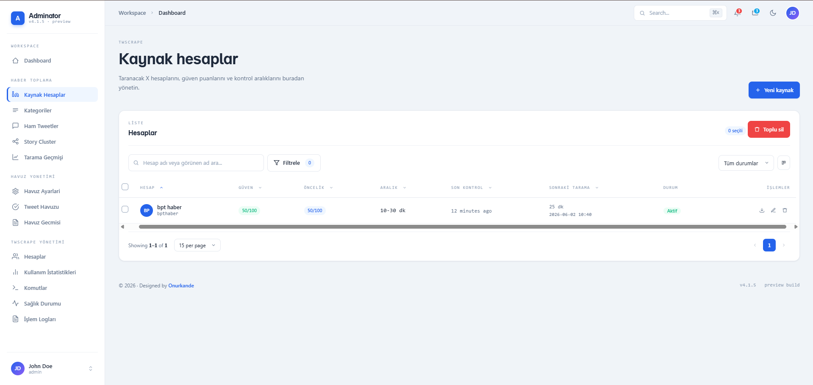
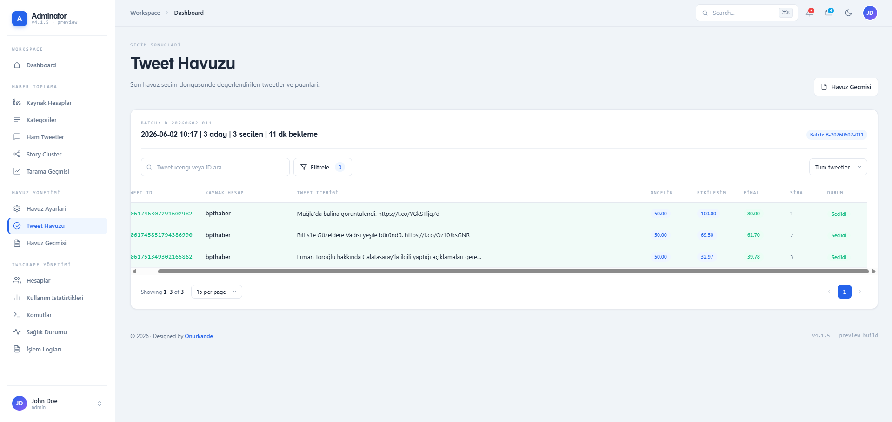
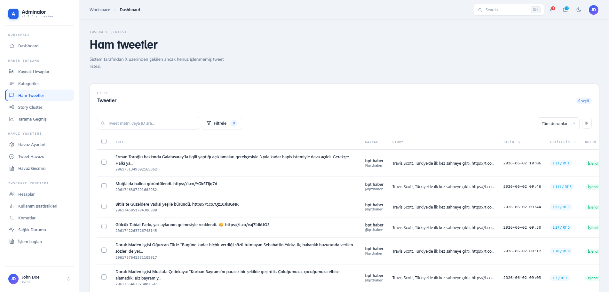

# NewsBot

Modern, modüler ve tamamen otomatik çalışan bir X (Twitter) haber toplama, analiz etme, içerik üretme ve yayınlama sistemidir.

## Proje Hakkında

NewsBot, belirlenen X kaynak hesaplarını düzenli olarak takip eden, bu hesaplardan gelen tweetleri toplayan, etkileşim ve öncelik puanlarına göre değerlendiren, haber değeri taşıyan içerikleri seçen ve yapay zeka yardımıyla haber formatına dönüştüren bir otomasyon platformudur.

Sistem yalnızca veri toplamakla kalmaz;

* Tweet toplar
* Tweetleri analiz eder
* Benzer içerikleri gruplayabilir
* Haber değeri hesaplar
* En değerli içerikleri seçer
* Yapay zeka ile haber üretir
* X üzerinde otomatik paylaşım yapar
* Tüm süreci loglar ve izler

## Ekran Görüntüleri

<!--
### Dashboard


-->

### Kaynak Hesap Yönetimi



### Tweet Havuzu






---

## Kullanılan Teknolojiler

### Backend

* Laravel 12
* PHP 8.3+
* MySQL
* Laravel Queue
* Laravel Scheduler

### Python Servisleri

* Python 3.11

#### twscrape

Kaynak hesaplardan tweet toplama işlemleri için kullanılır.

Proje:
https://github.com/vladkens/twscrape

#### gpt4free

AI içerik üretimi ve haber oluşturma işlemleri için kullanılır.

Proje:
https://github.com/xtekky/gpt4free

#### twitter-api-client

Oluşturulan içeriklerin X hesabında paylaşılması için kullanılır.

Proje:
https://github.com/trevorhobenshield/twitter-api-client

---

## Sistem Mimarisi

```text
Laravel
│
├── Scheduler
├── Queue
├── Admin Panel
├── Monitoring
├── Logging
│
└── Python Services
    ├── twscrape
    ├── gpt4free
    └── twitter-api-client
```

İş akışı:

```text
Kaynak Hesaplar
        ↓
Tweet Toplama
        ↓
Ham Tweetler
        ↓
Story Cluster
        ↓
Tweet Havuzu
        ↓
AI Üretimi
        ↓
Paylaşım
        ↓
Loglama ve Monitoring
```

---

## Yönetim Paneli Modülleri

### Kaynak Hesaplar

Takip edilen X hesaplarının yönetimi.

### Kaynak Kategorileri

Hesapların kategorilere ayrılması.

### Ham Tweetler

Toplanan tüm tweetlerin görüntülenmesi.

### Story Clusters

Benzer haberlerin gruplanması.

### Tweet Havuzu

Puanlama algoritması ile en değerli içeriklerin seçilmesi.

### Twscrape Yönetimi

Scraper hesaplarının yönetimi.

### Monitoring

Sistem sağlık durumunun takibi.

### Loglama

Tüm sistem işlemlerinin kayıt altına alınması.

---

## Kurulum

### Repository

```bash
git clone https://github.com/onurkande/NewsBot.git

cd NewsBot
```

### Laravel Kurulumu

```bash
composer install
```

```bash
cp .env.example .env
```

```bash
php artisan key:generate
```

Veritabanı ayarlarını `.env` dosyasında yapılandırın.

```bash
php artisan migrate
```

### Frontend Paketleri

```bash
npm install
```

```bash
npm run build
```

---

## Python Servis Kurulumu

### 1. twscrape

Dizin:

```bash
services/twscrape
```

Python 3.11 sanal ortam oluşturun:

```bash
python -m venv .venv
```

Aktifleştirin:

Windows:

```bash
.venv\Scripts\activate
```

Linux / macOS:

```bash
source .venv/bin/activate
```

Kurulum:

```bash
pip install twscrape
```

Ardından `accounts.db` oluşturulmalı ve X hesapları eklenmelidir.

Detaylı kurulum:

https://github.com/vladkens/twscrape

---

### 2. gpt4free

Dizin:

```bash
services/gpt4free
```

```bash
python -m venv .venv
```

```bash
pip install -U g4f[all]
```

Detaylı kurulum:

https://github.com/xtekky/gpt4free

---

### 3. twitter-api-client

Dizin:

```bash
services/twitter-api-client
```

```bash
python -m venv .venv
```

```bash
pip install twitter-api-client -U
```

Detaylı kurulum:

https://github.com/trevorhobenshield/twitter-api-client

---

## Sistemi Çalıştırma

Laravel:

```bash
php artisan serve
```

Queue Worker:

```bash
php artisan queue:work
```

Scheduler:

```bash
php artisan schedule:work
```

---

## Temel Özellikler

* Kaynak hesap yönetimi
* Tweet toplama sistemi
* Story Cluster sistemi
* Tweet havuz sistemi
* Öncelik puanlama sistemi
* Etkileşim puanlama sistemi
* AI içerik üretimi
* Otomatik paylaşım
* Monitoring sistemi
* Health Check sistemi
* Loglama sistemi
* Mail bildirim sistemi
* Queue mimarisi

---

## Yol Haritası

Planlanan geliştirmeler:

* Instagram entegrasyonu
* Telegram entegrasyonu
* Çoklu dil desteği
* Görsel üretimi
* Video içerik üretimi
* Trend analiz sistemi
